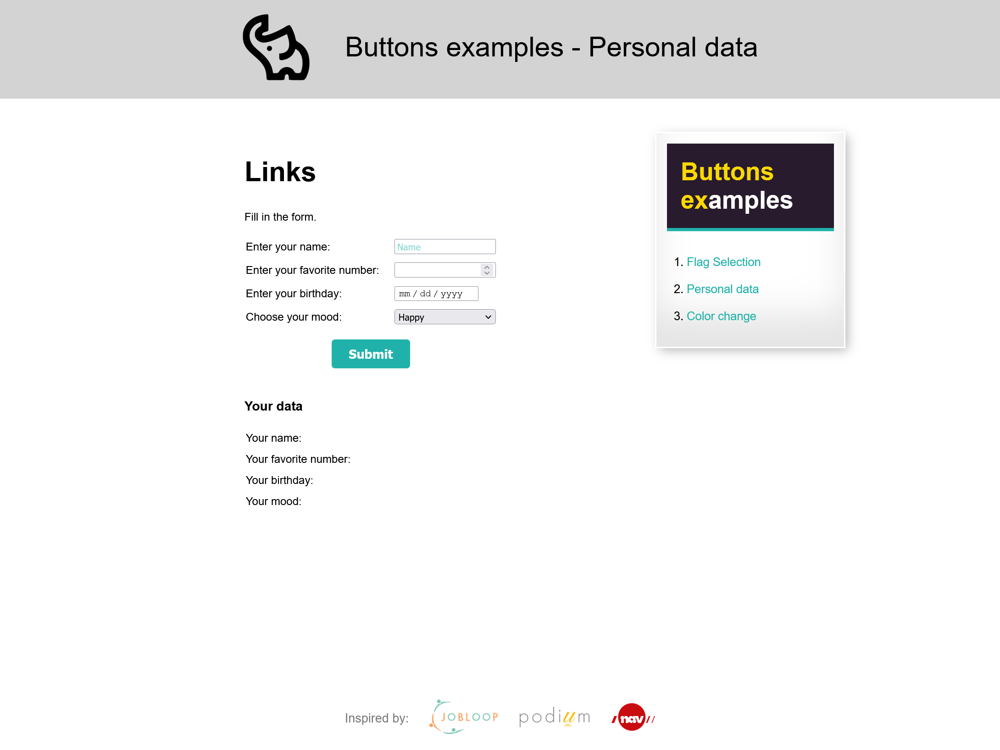
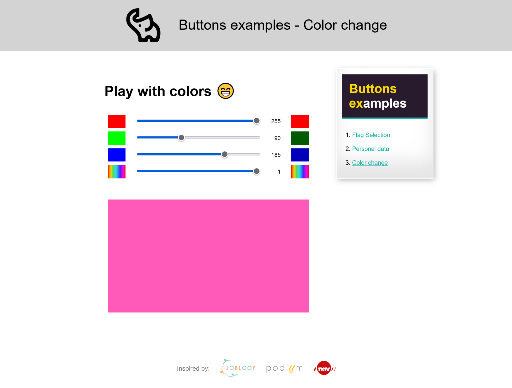

# Buttons del 2

[Source code](https://github.com/chriskodehub/KH-5_buttons_del_2)  
[Live demo](https://chriskodehub.github.io/KH-5_buttons_del_2/)

## Oppgave

Jeg har prøvd å lage koden så enkel som mulig, for at dere ikke skal slite dere ut med innleveringen. Hvis dere allikevel ønsker å gjøre mer ut av oppgaven, så må dere lage den som et skryteobjekt på profilen deres. 

Koden ligger under her og kan kopieres over i Visual Studio og rediges der, om du vil. 
[Koden ligger i jsfiddle (her)](https://jsfiddle.net/#&togetherjs=SRyAd96OU2).

Oppgaven går ut på at du skal ta vekk de knappene som du ikke vil bruke, og sett farger og endre på skrifttyper for overskrifter og paragrafer. Noen steder kunne det vært lagt til en paragraf. Værsågod - koden er din, gjør hva du vil og spør hvis du lurer på noe.

Dette er ment å være en litt "kjekk" oppgave, hvor du skal leke med farger og stiler i CSS.
Og ["cheat sheet" ligger (her)](https://htmlcheatsheet.com/css/)

## Demo
Hey everyone, I have a little challenge. Who can find a flower and a snowman on my website? Is he any brave? All methods allowed😁  

